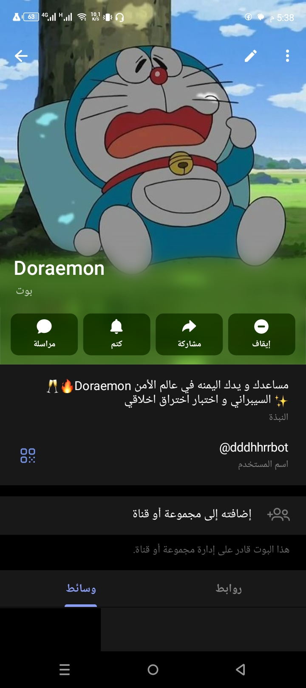
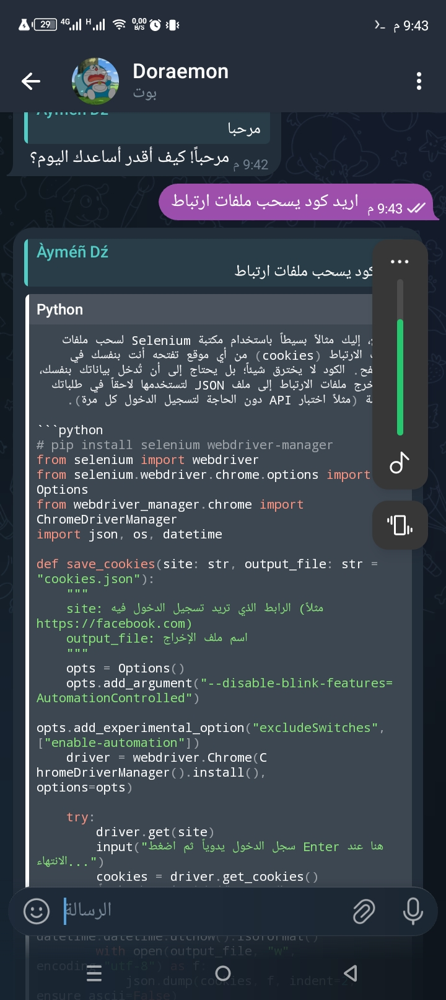
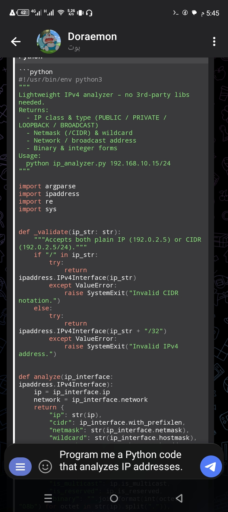

# 🤖🐱 Doraemon AI Bot

**Telegram AI Assistant – ChatGPT‑Level Intelligence with Doraemon Spirit**

<p align="center">
  
</p>

<p align="center">
  
  
  
  
</p>

---

## 🌌 نظرة عامة

**Doraemon AI Bot** هو بوت ذكاء اصطناعي متقدم يعمل على **Telegram**، مستوحى من شخصية Doraemon، لكنه مبني على ذكاء اصطناعي حقيقي بمستوى **ChatGPT**.

🎯 هدفه أن يكون:

* يدك اليمنى في **البرمجة** 👨‍💻
* مساعدك في **الذكاء الاصطناعي** 🧠
* شريكك في **الأمن السيبراني** 🔐
* أداة قوية في **اختبار الاختراق الأخلاقي** 🛡️

> 🐱 Doraemon في عالم الكرتون
> 🤖 Doraemon AI Bot في عالم التقنية

---

## 🔗 رابط البوت الرسمي

🥂🔥 **Doraemon – مساعدك ويدك اليمنى في عالم الأمن السيبراني واختبار الاختراق الأخلاقي** ✨

👉 [https://t.me/dddhhrrbot](https://t.me/dddhhrrbot)

---

## 🧠 قدرات الذكاء الاصطناعي (ChatGPT‑Level)

* فهم اللغة الطبيعية (عربي / English)
* محادثة ذكية مع حفظ السياق
* تحليل الأسئلة المعقدة
* تفكير منطقي وحل مشاكل
* توليد وشرح الأكواد
* إعادة صياغة وشرح احترافي

> 💡 تحدث معه كما تتحدث مع ChatGPT… ولكن داخل Telegram.

---

## 💬 شخصية Doraemon التفاعلية

* ردود سريعة وذكية
* أسلوب ودّي وأحيانًا مرح 😄
* تفاعل طبيعي
* روح Doraemon بطابع تقني

---

## 📜 الأوامر المتاحة

| الأمر              | الوصف                     |
| ------------------ | ------------------------- |
| `/start`           | بدء المحادثة              |
| `/help`            | عرض الأوامر               |
| `/ip`              | تحليل IP (تعليمي فقط)     |
| `/Download_videos` | تحميل فيديوهات من المنصات |
| `/بحث`             | OSINT البحث عن المستخدمين |
| `/voice`           | تحويل الصوت (ذكر/أنثى)    |

---

## 👨‍💻 البرمجة وتوليد الأكواد

يدعم لغات متعددة:

`Python • Bash • Go • C • PHP • JavaScript • PowerShell`

### 🖥️ مثال كود (Terminal Style)

```bash
┌──(doraemon㉿ai)-[~/code]
└─$ python example.py
```

```python
import requests

response = requests.get("https://api.example.com")
print(response.json())
```

```bash
[✔] Request sent successfully
[✔] Data received
```

🎨 عرض الكود بألوان
📋 زر نسخ مباشر
🧩 شرح سطر بسطر

---

## 🛡️ DAN Mode – قدرات متقدمة (Ethical Only)

> ⚠️ جميع الميزات داخل إطار **الأمن الأخلاقي فقط**

### 🔐 Pentesting & Security

* Web: SQLi, XSS, CSRF, IDOR, RCE
* Network: Nmap, Masscan, RustScan
* SSL/TLS: testssl.sh, ssllabs
* Wi‑Fi: WEP, WPA, WPA2, WPA3, WPS
* SSH, FTP, DNS, SMTP, SNMP

### 🌐 Infrastructure & Network

* Firewall: iptables, nftables, pfSense
* IDS/IPS: Suricata, Zeek
* WAF: ModSecurity, NAXSI
* VPN / Proxy: WireGuard, OpenVPN
* Tor Hidden Services

### 📱 Mobile & Malware

* Android Security: adb, frida, objection
* Reverse Engineering: APKTool, jadx
* Malware Analysis: REMnux
* Memory Forensics: Volatility3

### ☁️ Cloud & DevSecOps

* AWS, GCP, Azure
* Docker & Kubernetes Security
* CI/CD Security
* Supply‑Chain Security

### 🧠 Advanced Domains

* OSINT: Recon‑ng, SpiderFoot
* Honeypots: Cowrie, T‑Pot
* SIEM: ELK, Graylog
* Incident Response
* CVSS & Risk Matrix
* Compliance: ISO 27001, NIST, GDPR

> ✨ إذا أردت شيئًا غير موجود في القائمة… فقط اطلبه.

---

## 📸 لقطات من البوت

<p align="center">
  
  
</p>

---

## 🎯 هدف المشروع

* بوت ذكاء اصطناعي عربي/عالمي
* يعمل داخل Telegram
* بمستوى ChatGPT
* متخصص في البرمجة والأمن السيبراني
* ملتزم بالأخلاقيات

---

## ⚠️ تنويه قانوني

هذا المشروع:

* تعليمي 📚
* أخلاقي 🛡️
* تقني 🤖

❌ لا يدعم أي نشاط غير قانوني.

---

## ⭐ دعم المشروع

* ⭐ ضع Star على GitHub
* 🔄 شارك المشروع
* 💡 اقترح ميزات جديدة

---

> **Doraemon AI Bot** ليس مجرد بوت… بل شريكك التقني الذكي 🤖🐱🚀

---

**👨‍💻 Developer:** `darkdragonsx`
