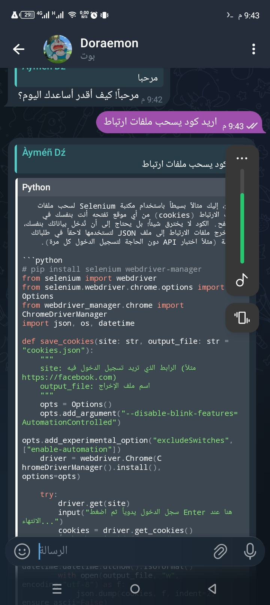
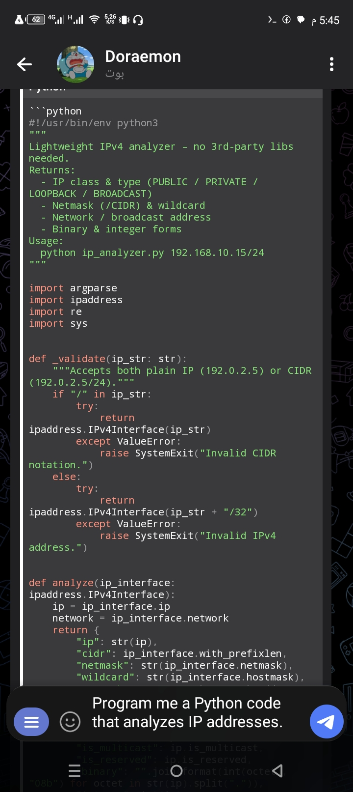

# 🤖🐱 Doraemon AI Bot

**Telegram AI Assistant – ChatGPT‑Level Intelligence with Doraemon Spirit**

---

## 🌌 نظرة عامة
**Doraemon AI Bot** هو بوت ذكاء اصطناعي متقدم يعمل على **Telegram**، مستوحى من شخصية Doraemon، لكنه مبني على ذكاء اصطناعي حقيقي بمستوى **ChatGPT**.

🎯 هدفه أن يكون:
- يدك اليمنى في البرمجة 👨‍💻
- مساعدك في الذكاء الاصطناعي 🧠
- شريكك في الأمن السيبراني 🔐
- أداة قوية في اختبار الاختراق الأخلاقي 🛡️

> 🐱 Doraemon في عالم الكرتون  
> 🤖 Doraemon AI Bot في عالم التقنية

---

## 🔗 رابط البوت الرسمي
🥂🔥 Doraemon – مساعدك ويدك اليمنى في عالم الأمن السيبراني واختبار الاختراق الأخلاقي ✨  
👉 [https://t.me/dddhhrrbot](https://t.me/dddhhrrbot)

---

## 🧠 قدرات الذكاء الاصطناعي (ChatGPT‑Level)
- فهم اللغة الطبيعية (عربي / English)  
- محادثة ذكية مع حفظ السياق  
- تحليل الأسئلة المعقدة  
- تفكير منطقي وحل مشاكل  
- توليد وشرح الأكواد  
- إعادة صياغة وشرح احترافي  

> 💡 تحدث معه كما تتحدث مع ChatGPT… ولكن داخل Telegram.

---

## 💬 شخصية Doraemon التفاعلية
- ردود سريعة وذكية  
- أسلوب ودّي وأحيانًا مرح 😄  
- تفاعل طبيعي  
- روح Doraemon بطابع تقني

---

## 📜 الأوامر المتاحة

| الأمر | الوصف |
|-------|-------|
| /start | بدء المحادثة |
| /help | عرض الأوامر |
| /ip | تحليل IP (تعليمي فقط) |
| /Download_videos | تحميل فيديوهات من المنصات |
| /بحث | OSINT البحث عن المستخدمين |
| /voice | تحويل الصوت (ذكر/أنثى) |

---

## 👨‍💻 البرمجة وتوليد الأكواد
يدعم لغات متعددة: Python • Bash • Go • C • PHP • JavaScript • PowerShell

---

## 📸 لقطات من البوت
 

---

## 🎯 هدف المشروع
- بوت ذكاء اصطناعي عربي/عالمي  
- يعمل داخل Telegram  
- بمستوى ChatGPT  
- متخصص في البرمجة والأمن السيبراني  
- ملتزم بالأخلاقيات

---

## ⚠️ تنويه قانوني
هذا المشروع:  
- تعليمي 📚  
- أخلاقي 🛡️  
- تقني 🤖  
❌ لا يدعم أي نشاط غير قانوني

---

## ⭐ دعم المشروع
- ⭐ ضع Star على GitHub  
- 🔄 شارك المشروع  
- 💡 اقترح ميزات جديدة

---

> **Doraemon AI Bot** ليس مجرد بوت… بل شريكك التقني الذكي 🤖🐱🚀

---

**👨‍💻 Developer:** darkdragonsx
